# インストール手順（お客様のサーバーで実施）

**仮想化がサポートされている環境が必要です**
AWSではmetal系インスタンス

## 1. `esas_windows_settings.zip` を `C:\esas_windows_settings.zip` にコピーし解凍
[リリース手順](release.md) で生成したファイル

## 2. Windows機能の設定
### 2.1. [コントロールパネル] から [Windowsの機能の有効化または無効化] を選択
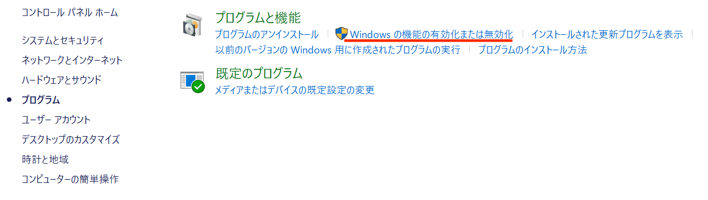

### 2.2. [Hyper-V] を有効化
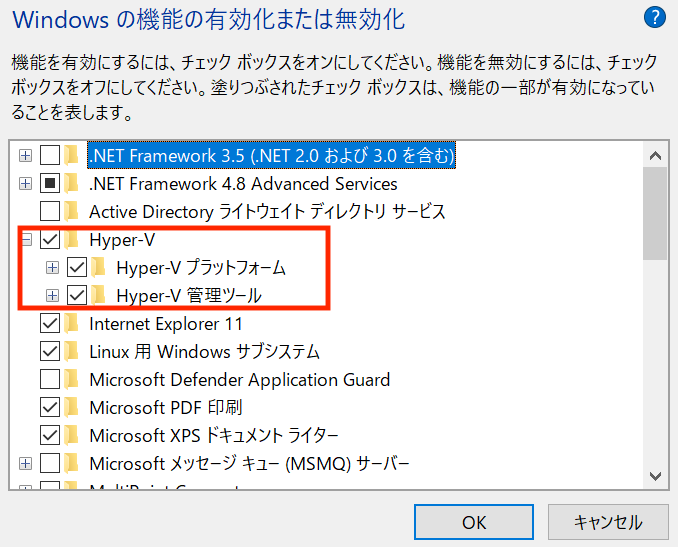

### 2.3. [PowerShell2.0] を有効化
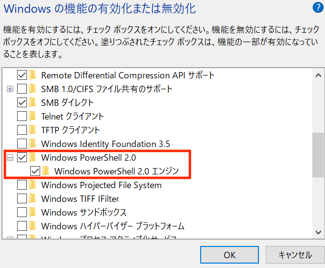

## 3. ネットワーク設定（NAPT＆ファイアーウォール)
### 3.1. 管理権限でPowerShellを起動
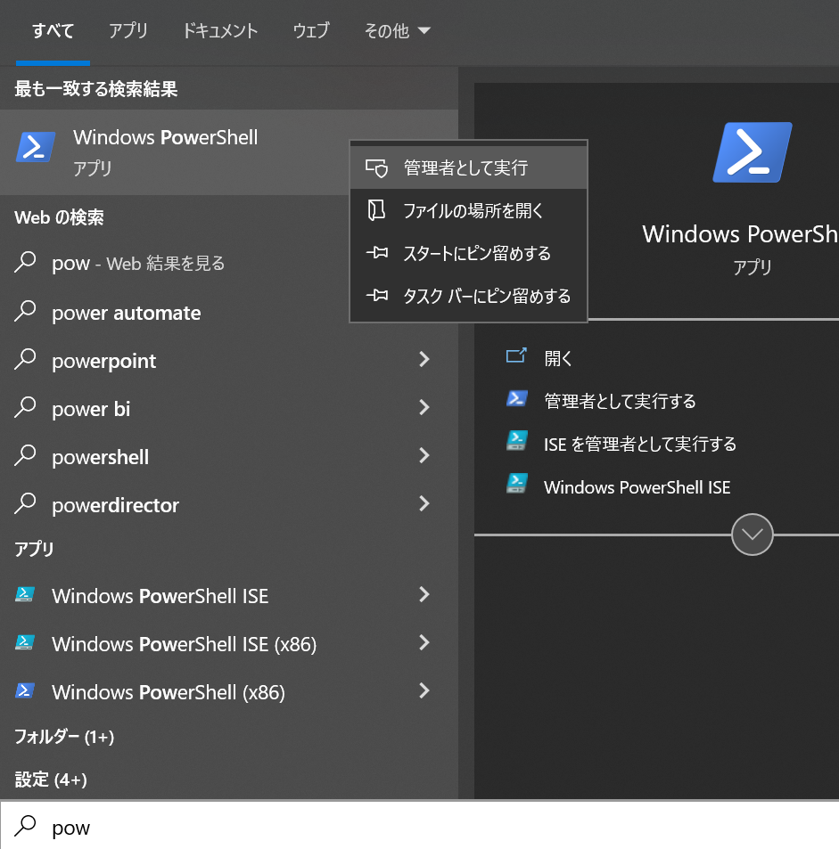

### 3.2. NAPT設定

```
 C:\esas_windows_settings\esas-setup.ps1
```

### 3.3. ファイアーウォール設定

```
 C:\esas_windows_settings\esas-firewall.ps1
```

## 4. Hyper-V
### 4.1. Hyper-Vマネージャーを起動
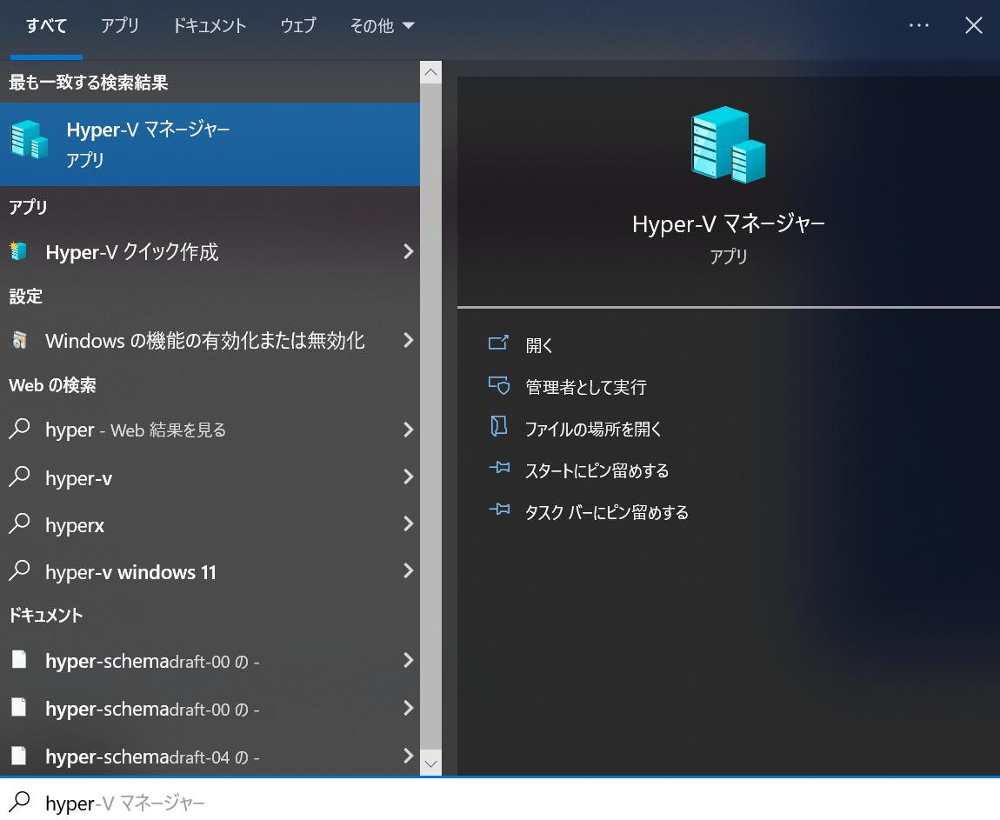


### 4.2. Ubuntu仮想マシンを作成
#### Windows10、11 Proの場合
※Windows10、11 HomeではHyper-Vを使用できません

#### [クイック作成] からUbuntu仮想マシンを作成  
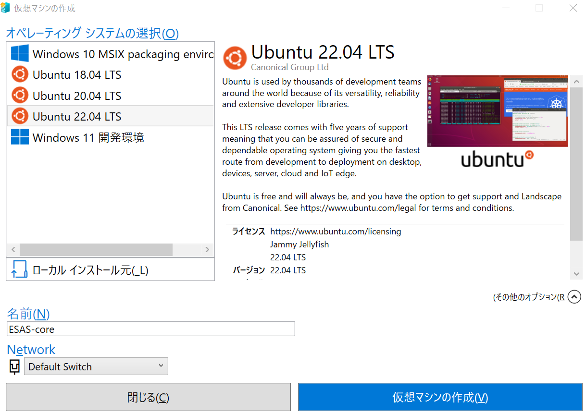

**選択および入力項目**

- Ubuntu 22.04 LTS
- ESAS-core
- Default Switch


#### Windows Serverの場合  
Hyper-vなどの仮想環境でUbuntu Desctopを使用するとログイン後にデスクトップ画面でフリーズするバグがある為、Ubuntu Serverを使用してください。  
※なお、クイック作成の場合はこの問題は発生しないが、Windows Serverではクイック作成はできません。  
#### [新規作成] からUbuntu仮想マシンを作成  
①Hyper-Vマネージャーを起動する  
②「新規」>「仮想マシン」  
③以下設定で構築  
・仮想マシンの場所：任意　※今回はデフォルトの場所で作成  
・世代：第2世代  
・起動メモリ：任意（マニュアルで後で設定）　※能動メモリはON  
・ネットワーク： [接続されていません]   
・仮想ハードディスク：任意？　（今回は「仮想ハードディスクを作成する（デフォルト）で127GBで作成）　  
・インストールオプション：ブートイメージファイルからオペレーティングシステムをインストールする  
　※isoファイルは「ubuntu-22.04.2-desktop-amd64.iso」を使用  
　上記の設定が終了後、「完了」をクリック  
④Hype-vマネージャー上で作成した仮想マシンを右クリックし、「設定」で以下を変更  
・「セキュリティ」>「セキュアブートを有効にする」のチェックを外す  
・「メモリ」>「RAM」が4096MB以上になるように設定

⑤Hype-vマネージャー上で作成した仮想マシンを右クリックし、「接続」をクリックした後に表示される画面で「起動」をクリック  
⑥起動した後は、「Try or Install Ubuntu」を選択  
⑥言語を「日本語」選択し、「Ubuntuをインストール」をクリック  
⑦キーボードレイアウト：「Japanese」のまま「続ける」  
⑧アップデートと他のソフトウェア：通常のインストール  
⑨ディスクを削除してUbuntuをインストール　※警告は無視して続ける  
⑩どこに住んでいますか？：「Tyokyo」のまま続ける  
⑪あなたの情報：任意のものを設定  
⑫インストールが完了するまで待ち、インストール後は仮想マシンを再起動  

⑬リリースファイル作成時に一緒に作成されている「release/esas-core-$BRANCH/esas-core-$BRANCH.iso」をWindows環境にコピー  
⑭Hype-vマネージャー上で作成した仮想マシンを右クリックし、「設定」＞SCISコントローラー＞「DVDドライブ」を選択し「追加」をクリック  
⑮追加した「DVDドライブ」を選択し、「イメージファイル」で、「esas-core-$BRANCH.iso」を選択  
⑯仮想マシンを再起動  
⑰作成した仮想マシンに接続すると、DVDとしてリリースファイルが認識されている為、「esas-core-$BRANCH.tar.gz」を/tmpにコピー  

### 4.3. Hyper-Vマネージャに[作成した仮想マシンの名前] が表示されるので [設定]

**[ハードウェアの追加] から [ネットワークアダプター]**
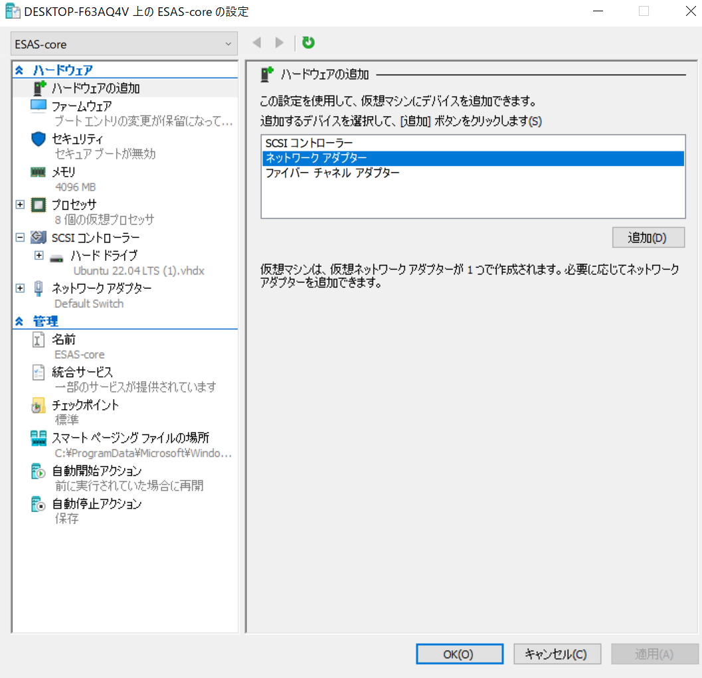
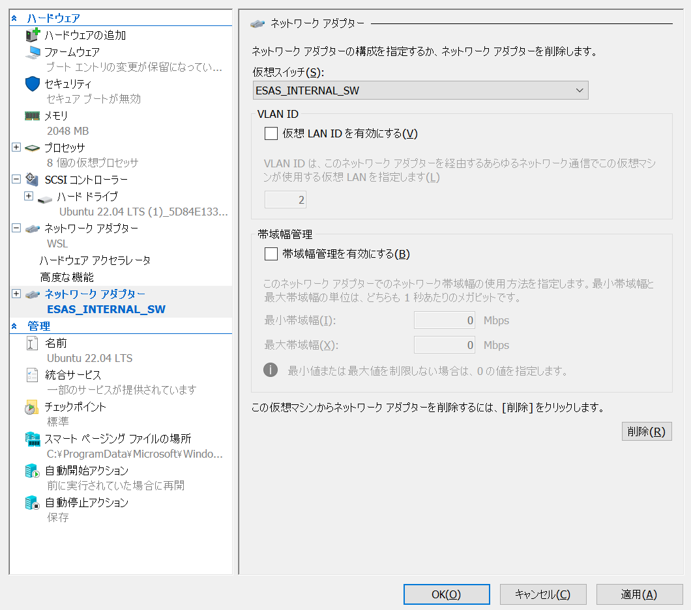

- 仮想スイッチ [ESAS_INTERNAL_SW] を選択

**[メモリ]**
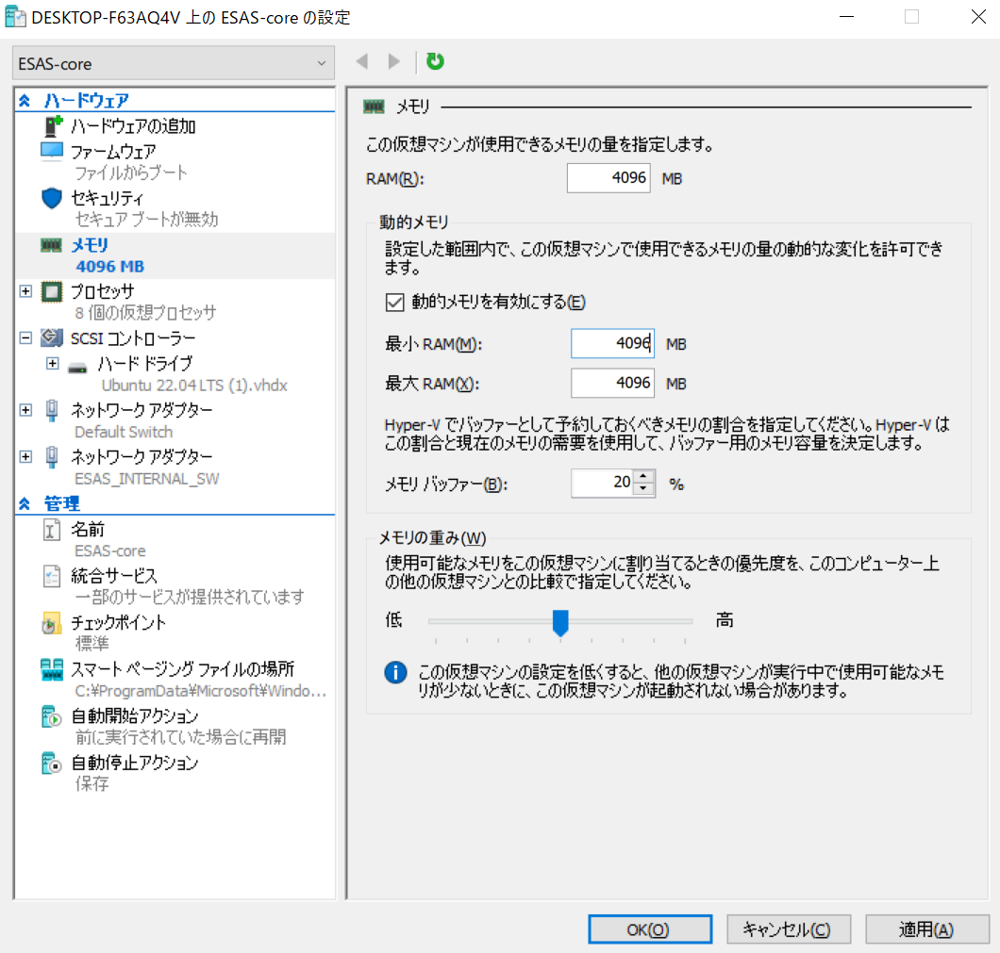

- 各フィールド4096MB以上を設定

## 5. [作成した仮想マシンの名前] の [接続] から [起動]

### 5.1. 【注意】アカウント情報の設定

初回起動画面を進めてアカウント情報を入力する際
**ユーザ名は `esas` 以外を指定してください**

### 5.2. ネットワーク設定 [Settings] から [Network]
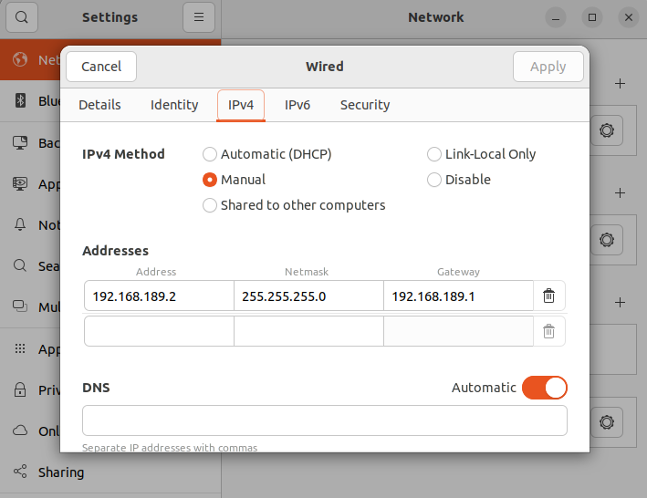

**入力項目**


- Address: 192.168.189.2
- Network: 255.255.255.0
- Gateway: 192.168.189.1
- DNS    : Automaticを外す & Hyper-VホストOSのDNSサーバIP（ipconfigで確認可能）  
　　　※お客様に指定のDNSサーバのIPアドレスがある場合はその値を入力  
      　　　　お客様環境でDNSサーバをリレーしている場合、ipconfigで確認したIPではRTP解析の際に名前解決できずに解析できない  

## 6. ESAS-core Linuxインストール
- [Linuxインストール手順](install-linux.md)

### 6.1. Samba設定
```
cd /tmp/esas-core-$BRANCH
sudo ./setup_smb.sh
```

## 7. Windowsネットワークドライブ設定
### 7.1. Windows Serverのセキュリティポリシーの設定
1.キーボードの［Windows］キーと［R］キーを同時に押して［ファイル名を指定して実行］画面を起動します。  
2.名前欄に「gpedit.msc」と入力して［OK］をクリックし、「グループポリシーの編集」を開きます。  

　▼グループポリシーエラー「この操作を実行するアクセス許可がありません」と表示される場合  
 　パソコンのログインアカウントが管理者ではありません。  
　 パソコンのアカウントを管理者でログインし直し、再度手順1からお試しください。  
　 管理者のログイン情報が不明な場合は、ネットワーク管理者にご相談ください。  

3.［コンピューターの構成］→［管理用テンプレート］→［ネットワーク］→［Lanman ワークステーション］を開く  
4.［安全でないゲストログオンを有効にする］をダブルクリック  
5.［有効］を選び、［OK］をクリック  
6. OSを再起動します。  

### 7.2. [エクスプローラー] [PC] から ネットワークドライブの割当て
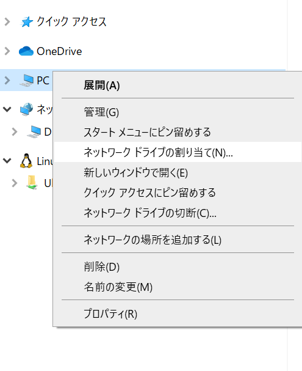

#### 7.2.1 Xドライブ


**選択および入力項目**

- X
- \\\\192.168.189.2\esas
- サインイン時に再接続する

#### 7.2.2 Yドライブ
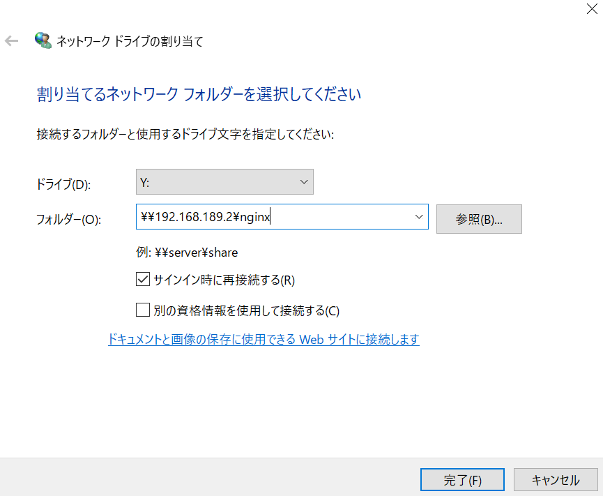

**選択および入力項目**

- Y
- \\\\192.168.189.2\nginx
- サインイン時に再接続する
