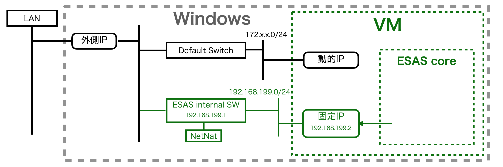

# Linux概要

| モジュール名 | 実体 | エラー判定／コード | 説明 |
|---|---|---|---|
|Nginx | Docker | HTTP通信不可 | HTTPリクエストのロードバランス＆バースト対策 |
|ESAS Core | Docker | HTTP status code (502) | お客様毎の設定と実装を含んだ実行単位。nodejsマルチプロセスで動作しNginxとはUnix socketで通信する |
|HTTP server | npmライブラリ(express) | 想定外 | リクエストパーサー等 |
|SessionManager | session_manager.js | ESAS error (211) | 各解析セッションの開始・終了・タイムアウト等の管理 |
|I/F v1| v1/* | ESAS-core V1 互換プロトコル | | |
|V1RtpSession | vi/rtp.js | ESAS error (203) | RTP解析セッション・サーバーやエンジンの管理単位 |
|RTPServer | rtp_server.js | ESAS error (204) | RTP on UDP サーバー実装。ある程度のパケット順管理を行う |
|V1Websocket | vi/websocket.js | ESAS error (206) |Websocket解析セッション・プロトコル上のBUG含み一定確率でセッションが不随意に終了してしまう |
|I/F v2| v2/* | ESAS-core V2 新規プロトコル | | |
|V2SocketIO | v2/socketio.js | ESAS error (207) | SocketIO解析セッション。2ch解析に対応 |
|V2ファイル解析| v2/file.js | ESAS error (208) | エントリーポイント `/uploadFile`, `/downloadFile` |
|EngineClient| engin_client.js | ESAS error (205) | Nemsysco dockerとのSocketIO通信の管理単位 |
|Redis| Docker | 応答不可（ログ） | セッション管理、ファイル解析の結果ファイルの一時的な保存、月毎解析回数の保存など |
|Nemsysco| Docker | ESAS error (205) | |

# Windows概要

Windows内にHyper-VでUbuntuを起動し、NAPTによるPortMappingでESAS-core linux を運用する。

PortMapping用の静的IPを得るために、専用の仮想ネットワークを構築している。
