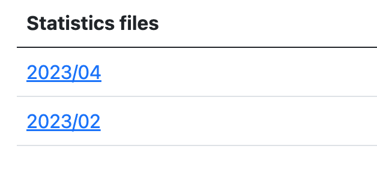
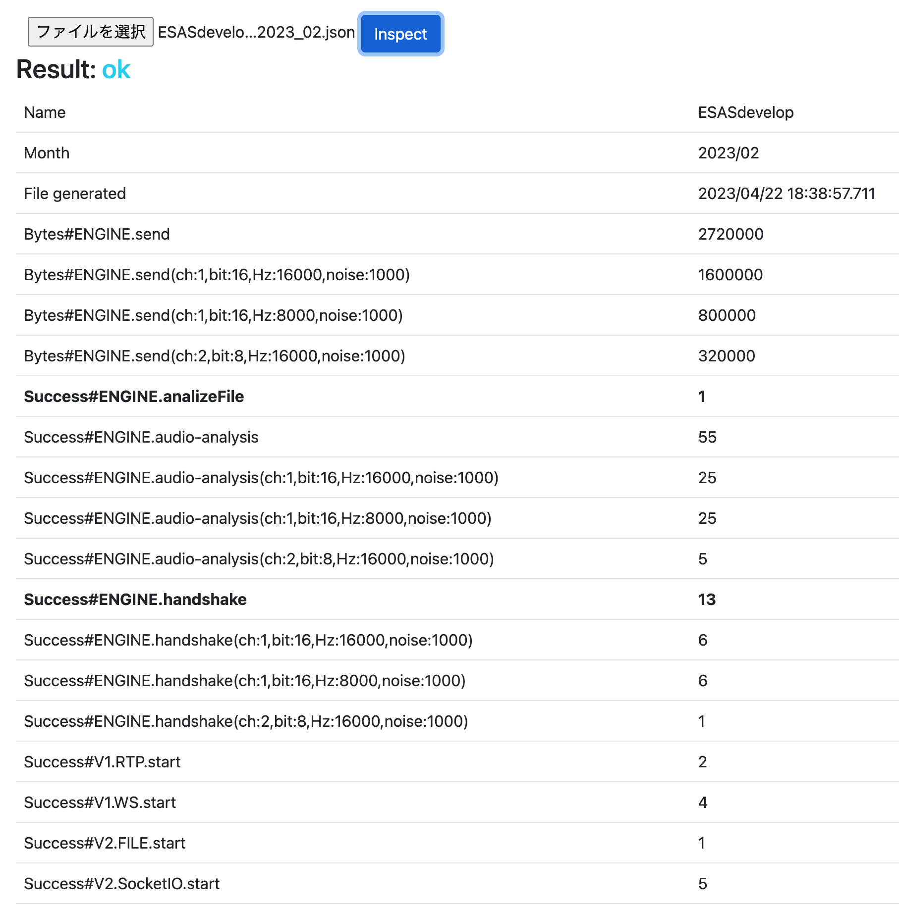
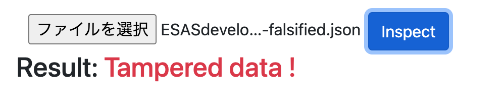
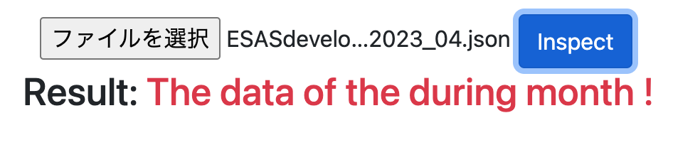

## 解析回数情報を取得（本番サービス稼働中のサーバー）
### URL: [deploy-url]//publish/statistics.html
該当月のファイル（json）をダウンロードする。

## ファイルの検証（ESJ開発環境のみ有効）
### URL: [deploy-url]//publish/test/inspection.html
| フィールド | 意味 |
|---|---|
| Success#ENGINE.handshake | リアルタイム解析数 |
| Error#ENGINE.handshake | リアルタイム解析エラー数 |
| Success#ENGINE.analizeFile | ファイル解析数 |
| Error#ENGINE.analizeFile | ファイル解析エラー数 |

### 情報ファイルが改竄されていた場合

### 情報ファイルが月中に生成されていた場合

